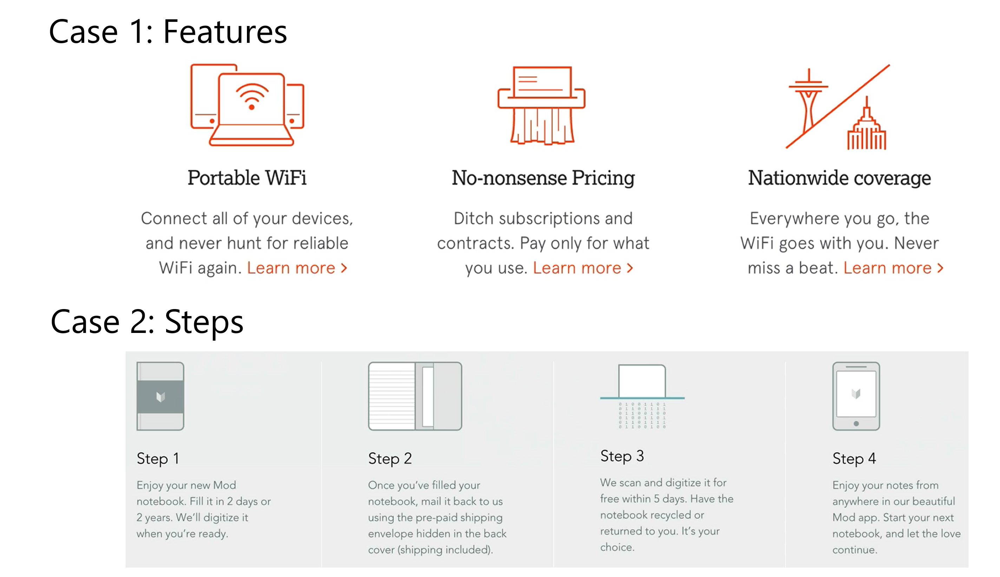

# Icons

1. Use icons to show features of product you are selling.

2. Icons can be used to show steps a user should follow to achieve some goal.

3. Use icons for actions and links.

   - Icons should be instantaneously recognizable.

4. Icons should not take a center stage in the design. Instead, they should play a supporting role.

5. Use icon fonts as they are vector based and scale endlessly. Using a rasterized image causes distortion.

6. [Icon Resources](http://codingheroes.io/resources/#icons)